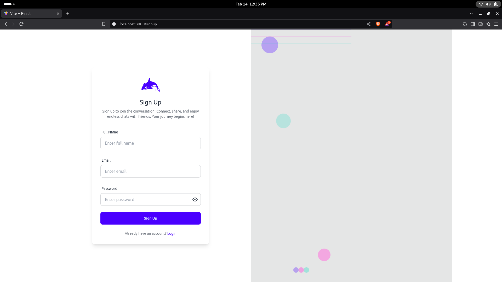
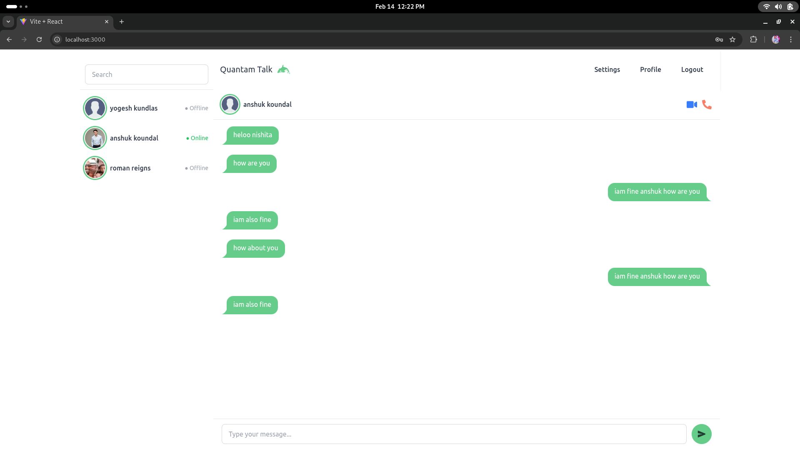
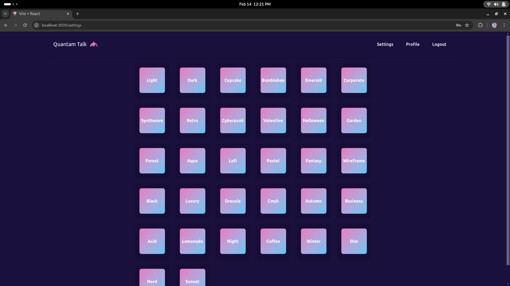
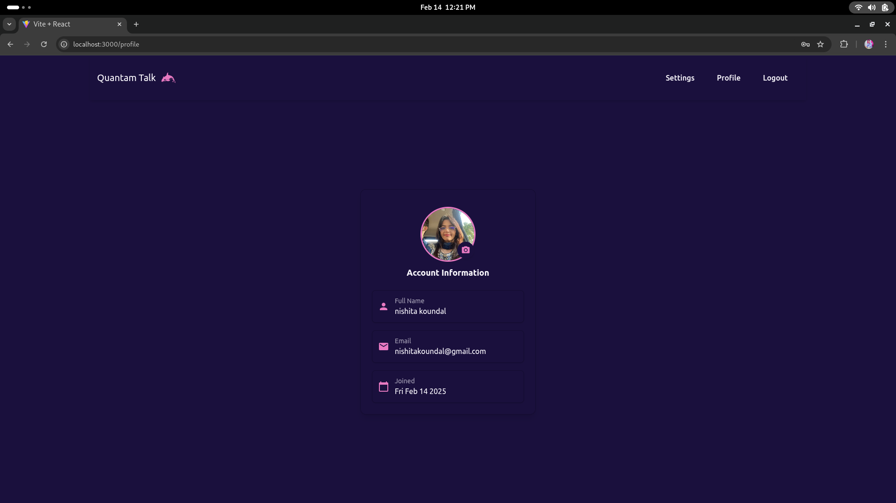

# ⚡ Quantam Talk - Real-Time Chat Application

Quantam Talk is a real-time, one-on-one chat application built using the **MERN stack** and **Socket.io**. It enables seamless messaging, media sharing, and real-time online presence tracking—empowering users with a fast and modern communication experience.

---

## 🎯 Aim

To build a full-stack real-time messaging platform with rich features like:

* Real-time communication
* Secure authentication
* Media sharing
* User presence tracking
* UI personalization

---

## 🚀 Features

### 🛠 Full-Stack Development

* Built with the **MERN stack**: MongoDB, Express.js, React.js, and Node.js.
* Real-time, bidirectional communication powered by **Socket.io**.

### 🔐 Secure Authentication

* User authentication via **JWT (JSON Web Tokens)**.
* Input validation using **Express Validator** to ensure security and prevent attacks.

### 🎨 Beautiful & Customizable UI

* Integrated **DaisyUI** with React for an elegant and responsive interface.
* Supports **32 DaisyUI themes** for user personalization.

### ⚡ Real-Time Messaging & Media Sharing

* Instant one-on-one chat with real-time updates.
* **Cloudinary** integration for image and media uploads.

### 👤 User Profile Customization

* Users can set or update their profile pictures.

### 👥 Online/Offline Presence Tracking

* Backend system maps `userId` to `socketId` using a dictionary.
* Tracks user connection status to display online/offline indicators accurately.

---

## 🛠️ Installation & Setup

### 🔧 Backend Setup

1. **Clone the repository:**

   ```bash
   git clone https://github.com/Anshuk147/Real-Time-Chat-Application.git
   cd backend
   ```

2. **Install dependencies:**

   ```bash
   npm install
   ```

3. **Configure environment variables** in `.env`:

   ```
   PORT=3000
   MONGODB=mongodb://localhost:27017/MernChatApp
   JWT_SECRET=your_jwt_secret
   CLOUDINARY_CLOUD_NAME=your_cloud_name
   CLOUDINARY_API_KEY=your_api_key
   CLOUDINARY_API_SECRET=your_api_secret
   NODE_ENV=development
   ```

4. **Start the backend server:**

   ```bash
   npm start
   ```

### 💻 Frontend Setup

1. **Navigate to the frontend directory:**

   ```bash
   cd frontend
   ```

2. **Install dependencies:**

   ```bash
   npm install
   ```

3. **Start the frontend server:**

   ```bash
   npm start
   ```

---

## 🧰 Technologies Used

| Technology     | Purpose                                          |
| -------------- | ------------------------------------------------ |
| **MongoDB**    | NoSQL database for storing chat and user data    |
| **Express.js** | Backend framework for building RESTful APIs      |
| **React.js**   | Frontend framework for a dynamic and reactive UI |
| **Node.js**    | Server-side runtime for backend services         |
| **Socket.io**  | Real-time, event-driven communication            |
| **Cloudinary** | Image/media hosting and optimization             |
| **JWT**        | Secure token-based authentication                |
| **DaisyUI**    | UI component library with 32 built-in themes     |

---
## 📸 Screenshots

### 🔐 Signup Page  
Clean and modern registration form with input validation and error handling.  


---

### 📱 Responsive Layout  
Fully optimized for mobile, tablet, and desktop for a seamless user experience.  


---

### 💬 Real-Time Messaging UI  
Instant one-on-one messaging with media sharing and smooth auto-scrolling.  


---

### 🎨 Theme Customization (32 DaisyUI Themes)  
Switch between 32 built-in themes to personalize the chat interface.  


---

### 👤 Profile Page  
Users can view and update their profile pictures and account details.  



## 🌱 Future Enhancements

* 🔸 Group chat support
* 🔸 Typing indicators and message reactions
* 🔸 End-to-end encryption for private messaging
* 🔸 Push notifications for new messages

---

## 📬 Contact

Have questions or want to contribute?
Feel free to reach out or open an issue in the repository.


---

**Quantam Talk** – *The future of seamless communication!* 🚀

---
